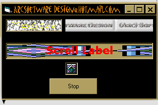



## Scroll Label ocx

### Description

This is the Source code for a label that has all the function of a regular label but it also has a picture proportie that can be scrolled at different speeds or not at all. Comes with example project..PLEASE take 5 seconds and put in a vote. Good or bad. Thanks =)
 
### More Info
 
'Start the timers and set the scroll speed and movement

'Failure to set the speed and movement will result in

'a label that doesnt move.

I.e..

ScrollLabel1.StartIt

ScrollLabel1.Speed (40)

ScrollLabel1.Movement (40)

The only known side effects are some flickering on large labels that are moving.

             |
---                |---
**Submitted On**   |2001-12-01 09:41:14
**By**             |[Optima Multimedia](https://github.com/Planet-Source-Code/PSCIndex/blob/master/ByAuthor/optima-multimedia.md)
**Level**          |Intermediate
**User Rating**    |3.7 (11 globes from 3 users)
**Compatibility**  |VB 5\.0, VB 6\.0
**Category**       |[OLE/ COM/ DCOM/ Active\-X](https://github.com/Planet-Source-Code/PSCIndex/blob/master/ByCategory/ole-com-dcom-active-x__1-29.md)
**World**          |[Visual Basic](https://github.com/Planet-Source-Code/PSCIndex/blob/master/ByWorld/visual-basic.md)
**Archive File**   |[Scroll\_Lab387821212001\.zip](https://github.com/Planet-Source-Code/optima-multimedia-scroll-label-ocx__1-29379/archive/master.zip)

